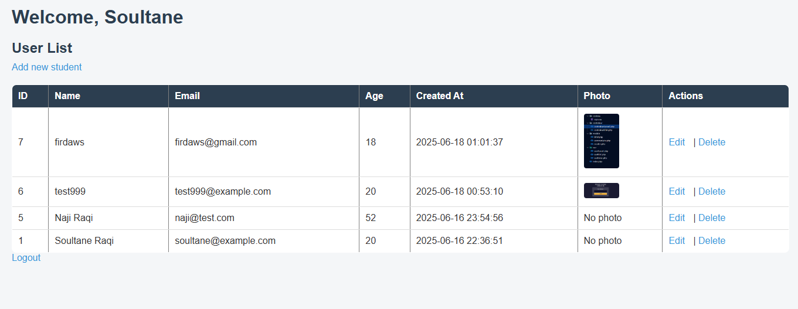

# PHP Student Management Project

A simple student management web application built with **PHP**, **MySQL**, **HTML/CSS**, and a bit of **JavaScript**. It supports user authentication and CRUD operations for managing student records.

## 📂 Features

- ✅ User Signup & Login
- 📋 View student list
- ➕ Add new student (with profile photo)
- ✏️ Edit student information
- ❌ Delete student
- 📷 Upload & display student photo
- 🎨 Simple modern styling using CSS

## 🧰 Tech Stack

- PHP
- MySQL
- HTML5 / CSS3
- JavaScript
- Git

## 🖼️ Screenshot




---

## 🏁 How to Run This Project

1. **Clone the repository**

```bash
git clone https://github.com/SoultaneRaqi/phpSimpleProject.git
```

2. **Import the database**

- Create a MySQL database.
- Import the `db.sql` file into it using phpMyAdmin or the MySQL CLI.

3. **Configure the database connection**

Edit the `connection.php` file and update your DB credentials:

```php
$host = "localhost";
$dbname = "your_db_name";
$username = "your_username";
$password = "your_password";
```

4. **Place the project folder in XAMPP**

Move the project to your XAMPP `htdocs/` folder.

5. **Start XAMPP**

- Start **Apache** and **MySQL** from XAMPP.
- Visit `http://localhost/phpSimpleProject` in your browser.

---

## 📁 Project Structure

```bash
├── add_student.php
├── connection.php
├── db.sql
├── delete_student.php
├── edit_student.php
├── index.php
├── login.php
├── logout.php
├── signup.php
├── style.css
├── uploads/            # Contains uploaded student photos
│   └── .gitkeep        # Keeps folder tracked by Git even if empty
```

---

## ⚠️ Notes

- Uploaded photos are stored in the `uploads/` folder.
- Make sure the `uploads/` folder is writable (`chmod 755` or `777` if needed on Linux).
- A `.gitkeep` file is used to retain the empty `uploads/` folder in Git.

---

## 💻 Author

**Soultane Raqi**

GitHub: [SoultaneRaqi](https://github.com/SoultaneRaqi)

---

## 📜 License

This project is licensed under the MIT License.